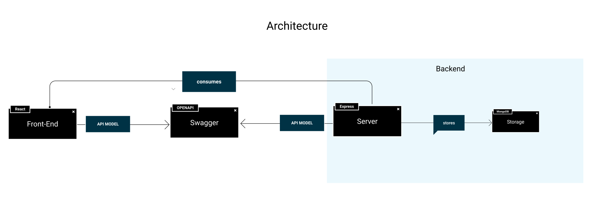
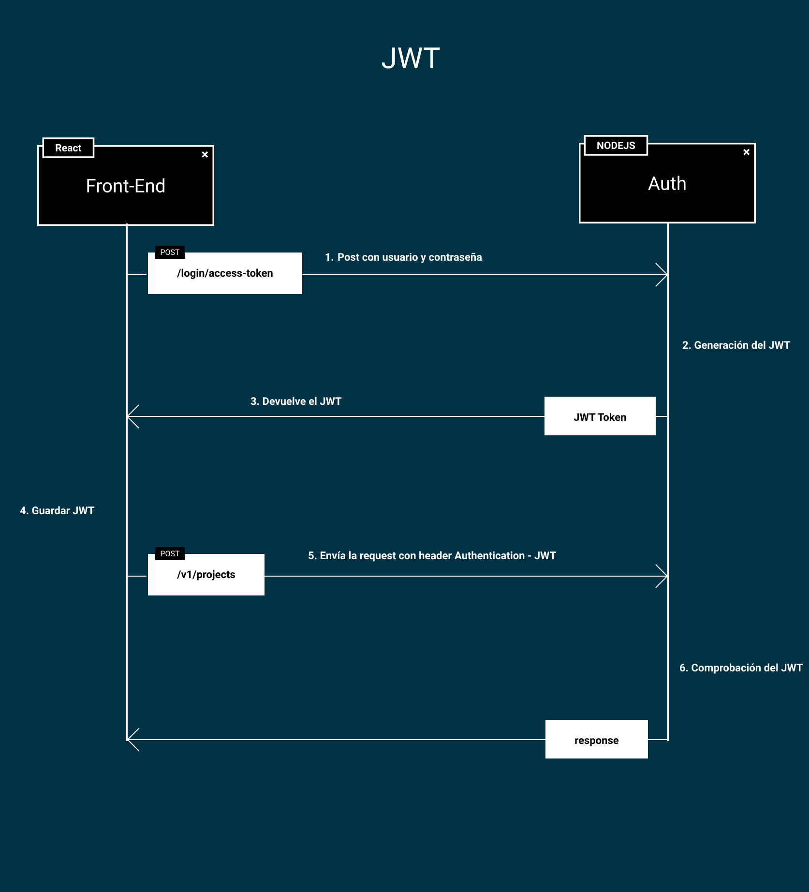

# Proyecto Web - Backend + Front + BBDD



## Prototipo

Una versión interactiva del proyecto se puede encontrar en la [Página de Figma](https://www.figma.com/proto/3e43h8TrzwpjfKwXvFxZoP/Taller?page-id=144%3A51&node-id=147%3A3&viewport=254%2C48%2C0.21&scaling=min-zoom&starting-point-node-id=147%3A3).

Además, como se enseñará en el propio proyecto, podemos ver el prototipo final en [este link](https://taller-threepoints-1.netlify.app/)

## Setup

Para poner en marcha el proyecto tenemos que seguir los pasos detallados en el [CONTRIBUTING.md](CONTRIBUTING.MD)

## Tecnologías

Este proyecto cuenta con las siguientes tecnologías, que se encuentran dentro del prototipo.

### UI

* [React](https://reactjs.org/docs/hello-world.html)
* [Create React App](https://create-react-app.dev)
* [Styled Components](https://styled-components.com)
* [Internationalization](https://react.i18next.com)
* [Lottie](https://lottiefiles.com/blog/working-with-lottie/how-to-use-lottie-in-react-app)
* [React Router](https://reactrouter.com/web/guides/quick-start)
* [Typescript](https://www.typescriptlang.org)
* [Swagger](https://swagger.io)
* [Figma](https://www.figma.com)
* [JWT](https://jwt.io)
* [Fetch](https://developer.mozilla.org/en-US/docs/Web/API/Fetch_API)
* [DotEnv](https://github.com/motdotla/dotenv)

### Backend

* [Node](https://nodejs.org/en/)
* [JWT](https://jwt.io)
* [Typescript](https://www.typescriptlang.org)
* [Swagger](https://app.swaggerhub.com/apis/lucferbux/ThreePoints/1.0.0)
* [Express Router](https://expressjs.com/en/guide/routing.html)
* [DotEnv](https://github.com/motdotla/dotenv)
* [Joi](https://github.com/sideway/joi)

### BBDD

* [MongoDB](https://www.mongodb.com)
* [Mongoose](https://mongoosejs.com)

### Swagger

Swagger es una especificación de la API que vamos a utilizar en el proyecto, permite conocer las rutas, su configuración de roles y el modelo de datos. Existe una [live version](https://app.swaggerhub.com/apis/lucferbux/ThreePoints/1.0.0) configurada, pero nuestro propio backend soporta la especificación.


La documentación se encuentra en la ruta:

```bash
[NodeRoute]/docs
Default -> http://localhost:4000/docs
```

### JWT

JWT es una especificación de Autenticación que se utiliza sobre todo para control de autenticación entre dos actores. Se introdujo con la especificación [RFC 7519](https://tools.ietf.org/html/rfc7519) por el IEFT.

Aunque se puede usar con todo tipo de comunicaciones, JWT es muy popular para el control de autenticación y autorización mediante HTTP, es por ello que lo hemos introducido en nuestra API.

HTTP es un protocolo sin estado, es por ello que el servidor no tiene control sobre peticiones anteriores para el cliente, es por ello que tener un token que controle la sesión entre cliente y servidor con un flujo controlado hace que podamos autenticar y contorlar algunas rutas sensibles dentro de una sesión.



La **estructura de un JWT** es la siguiente: Se compone de información codificada en Base64 con una cabecera, un payload y una firma única. Dentro de la página oficial de [https://jwt.io](jwt) podemos comprobar un token.


La cabecera tiene información acerca del algoritomo que se usa y que tipo de token, el payload contiene datos acerca del usuario y su rol y la firma se utiliza para validar la veracidad de este token.

### Scripts BBDD

Para inicializar el proyecto con datos iniciales, utilizamos la importación de estrucutras **json** dentro de **MongoDB**. Para ello usamos el comando `mongoimport --jsonArray` con el que importaremos los json creados. El código usado es el siguiente.

```bash
mongoimport --jsonArray --db portfolio_db --collection users --file mockUsername.json
mongoimport --jsonArray --db portfolio_db --collection profile --file mockProfile.json
mongoimport --jsonArray --db portfolio_db --collection projects --file mockProjects.json
```

Como podéis comprobar, los ficheros `mockProfile.json`, `mockProjects.json`y `mockUsername.json`. Cambiando los datos allí, e importando los nuevos ficheros, tendremos los cambios reflejados en nuestro documento.
